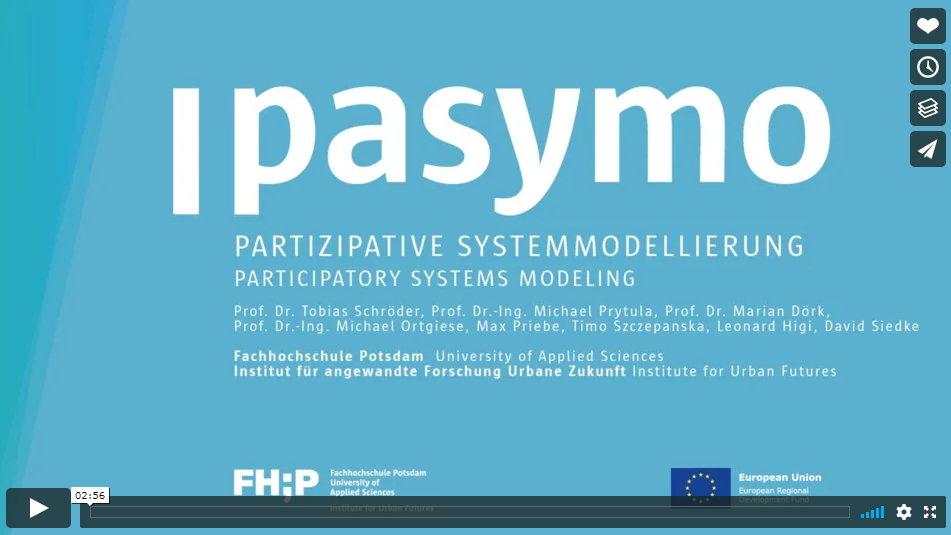

# PaSyMo
## Participative System Modeling as a Tool for Integrated Urban Development

The research project PaSyMo is located at the Institute for Applied Research (IaF) Urban Future of the FH Potsdam and is funded by the European Regional Development Fund (ERDF). The project developed instruments for integrated urban developments that are tailored to the concrete needs of small and medium cities. During the research process PaSyMo profited from the involvement of urban actors and citizens in different participatory formats for the co-creation of models, computer simulations.

See [Wiki](https://github.com/tmrmn/pasymo/wiki) for more information.

